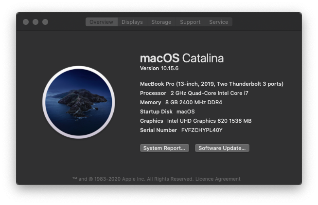

# Opencore Build for Acer Aspire 5 A514-52 78MD

  

## Specs

|   |   |
|---|---|
|CPU|i7-8565U|
|GPU|intel UHD 620|
|SSD|512 GB NVME.m2|
|RAM|8GB|
|Ethernet|Realtek RTL 8111|
|Wifi Adapter|Qualcomm Atheros|
|Bluetooth|LiteOn Bluetooth (Atheros Drivers)|
|Trackpad|Synaptics Trackpad|

## Working Status

- [x] Internal Audio and Headphone Jack
- [x] iGPU (Does not have a discrete GPU)
- [x] Battery Management
- [x] Ethernet
- [x] Display Brightness and control with Keys
- [x] Sleep
- [x] USB2.0 ports, USB3 ports,
- [x] Webcam
- [x] Trackpad with multi finger gestures 
- [x] iMessages and FaceTime
- [ ] Bluetooth (Works and connects, but can't turn off)
### To be tested
- [ ] HDMI
- [ ] Internal SD Card Reader    

## Installation Guide
1. This guide will help you from the start to the end : [Dortania Gitbook](https://dortania.github.io/OpenCore-Install-Guide/)

1. Generating Serial Number : 
GenSMBIOS from Corpnewt [GenSMBIOS](https://github.com/corpnewt/GenSMBIOS)
1. Cross checking config.plist :  [Sanity Checker](https://opencore.slowgeek.com/)
1. Further Help on Discord : [Discord Server](https://discord.com/channels/186648463541272576/251043252046659586)

## Special Thanks to :

* [Acidanthera](https://github.com/acidanthera) for kexts, [Opencore](https://github.com/acidanthera/OpenCorePkg) and everything.
* [Dortania](https://github.com/dortania/Opencore-Install-Guide) for the neat and detailed installation instructions.
* [CorpNewt](https://github.com/corpnewt) for [ProperTree](https://github.com/corpnewt/ProperTree), [SSDTTime](https://github.com/corpnewt/SSDTTime), [GenSMBIOS](https://github.com/corpnewt/GenSMBIOS)
* [alexandred](https://github.com/alexandred/) for [VoodooI2C](https://github.com/alexandred/VoodooI2C) for trackpad related stuff.
* A few People on the discord server
* To anyone else whose work I might have used.
